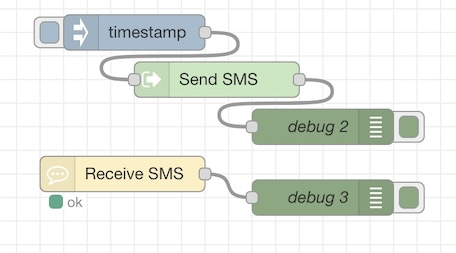
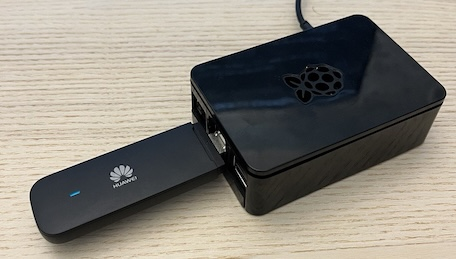

# Node-RED Huawei LTE USB Stick SMS Module

 

## Overview

This module provides nodes that enable the sending and receiving of SMS messages using the Huawei LTE USB Stick E3372 in a Node-RED environment.

To use this module, ensure that the USB stick is connected to a computer running Node-RED as a network adapter. The module sends commands for sending or receiving SMS via HTTP requests to the integrated web server of the USB stick.

For proper functioning, you need to provide the password for the web admin interface of the USB stick.

During the development of this module, I conducted research on how the web admin interface works, leveraging browser inspector tools. Although I couldn't find an official API, I discovered helpful projects on GitHub. The most challenging aspect was implementing the authorization process.

The code of the module is structured to maintain only one session with each stick at any given moment. All requests are executed in sequence to prevent potential issues. It was observed that multiple sessions or simultaneous requests could lead to problems, such as an authorization request failure with the message "Already authorized."

You can use this module to:

- Forward SMS to email or Telegram or whatever channel Node-RED can use
- Send SMS notifications from Node-RED flows
- Receive SMS commands in Node-RED flows

I tested this module for several months on couple of devices E3372h-320 with firmware 11.0.1.1(H697SP1C00). I consider it to be fairly reliable for home use. It is possible that it will work with other devices which run the same integrated web server (called HiLink).

For clarity I'm not related in any way with Huawei.


## Install

```
$ npm install @nickiv/node-red-huawei-sms
```

## Usage

### Receive SMS

To receive an SMS drag Receive SMS node to flow. Add SMS config node or select the one you set up earlier. Upon receiving an SMS node will emit an object containing message with some metadata. New messages are checked every 20 seconds. Received messages are being deleted from Inbox of the stick. When flow starts all messages that are currently in the Inbox will be emitted.

### Send SMS

To send an SMS drag Send SMS node to flow. Add SMS config node or select the one you set up earlier. Specify target phone number in the node properties. Upon receiving a message with string payload, node will try to send it as SMS to specified target phone. Result of the operation will be set as message payload on output.

Sent messages are being deleted from Outbox of the stick.